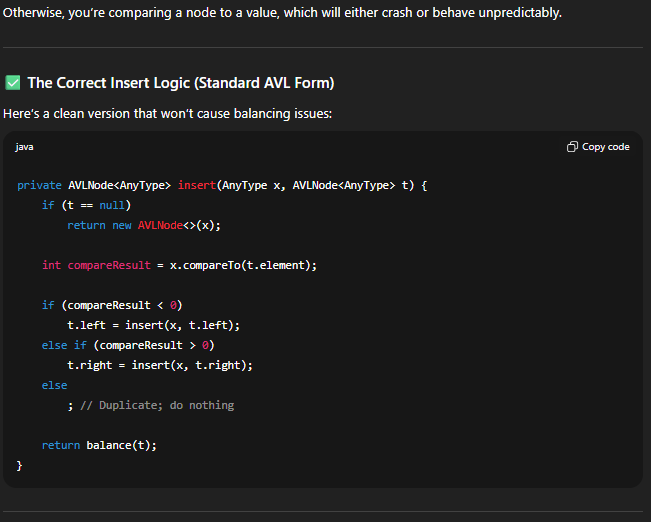
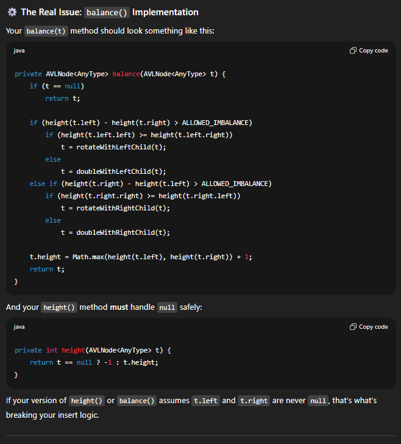

# Project 2 @ CSC 201 Fall 2025: AVL Tree

## Pledged Work Policy

This is a ___Pledged Work___ assignment.  This means that the work you submit for grading ___must___ be your work product.  
You may not submit the work of others outside of your team, or the modification of work of others outside of your team.
You are encouraged to talk with each other about general problems.  For example, you may talk to someone about "What does it mean when the compiler says there is a semicolon missing on line 20", or "I can not get my assignment template to download from GitHub, what did you do?".  However, you may not engage in "Could you send me a copy of your work so I can see how to get started?".  You may get full and detailed assistance from me, the Teaching Assistant (TA), and the TAs in the Computer Science Center.  If you have any question about the appropriateness of assistance, do not hesitate to consult with me.

Use of ChatGPT or similar resources are encouraged but they must be documented in this README.md. That includes 1) the exact prompt used, 2) the screenshots of the outputs, and 3) your personal assessment on how useful it was. Even erroneous or unuseful results must be documented.

If I believe you have violated our ___Pledge Work___ agreement, I will pursue this matter through the college Honor Council.

## Overview

An AVL Tree is a type of self-balancing Binary Search Tree (BST) that ensures that the tree is approximately balanced. An AVL Tree remains balanced as elements are inserted or deleted. During class, we discussed the general algorithms for a BST and an AVL tree.  In particular, we emphasized how a regular BST structure can become basically a linked list if its balance is not maintained, resulting in a O(N) running time instead of the O(log N) we expect from a properly balanced BST.

In this project, you will:
1. Implement a generic BST with an iterator interface. (You developed this in Project 1, which you can use as is or update.)
2. Implement a generic AVL Tree with an iterator interface.
3. Insert sorted and randomized datasets into BST and AVL Trees.
4. Time the insertion and search operations for BST and AVL Trees.
5. Graph and analyze the insertion and search operation timings.

## Invocation and I/O Files:

The name of the program is `Proj2` ( provided with a `main` method in`Proj2.java` ). 

You are encouraged to run and debug code in __IntelliJ IDEA__. Also, the program can be invoked from the command-line as:

```shell
java Proj2 {dataset-file} {number of lines}
```

## 1. **Generic BST with Iterator Interface**

You already created Node and BST classes with a Comparable Interface for Project 1. If your implementation is perfect, you can simply copy over your files and continue to the next section. However, you can make whatever modifications that you deem necessary to complete this project.

## 2. **Generic AVL Tree Interface**

I have enclosed three starter codes:
1. `AVLTree.java`
2. `TestAvl.java`
3. `Proj2.java`

The `AVLTree.java` file contains an overall structure of that AVL Tree class, and you are expected to complete the code where it is indicated (Search for `// FINISH ME`). The `TestAvl.java` file must not be modified, and it will be used for testing your AVL Tree class. It does not check for every error, but I hope that it will be helpful for you. The `Proj2.java` file contains a starter code for you to implement the main driver of the program.

## 3. **Sorted and Randomized Datasets for BST and AVL Trees**

You already created a well-written class to store the records from a dataset for Project 1. If your dataset and implementation is perfect, you can simply copy over your files. However, you can make whatever modifications that you deem necessary to complete this project, and you can also choose a completely different dataset. The source of the dataset and modifications made to it must be documented inside the class.

I have enclosed `Proj2.java` that takes in two command line arguments: 1) the filename if your dataset, and 2) the number of lines of your dataset to read. 

You will read your dataset and store the data in an ArrayList. To sort and randomize your ArrayList, you will use the `Collections.sort()` and `Collections.shuffle()` commands.

You will then insert each element if your sorted and randomized ArrayLists into BST and AVL Trees. In total, there will be four trees.

You will then use your original ArrayList to search for each element in your BST and AVL Trees. In total, you will be searching four times.

## 4. **Time the Insertion and Search operations for BST and AVL Trees**

For each of the insertion and search operations, you will use `System.nanoTime()` to calculate the time it takes to run the insertion and search operations for the sorted and randomized BST and AVL Trees. Your program will print out the number of lines and the times to insert and search for BST and AVL Trees to the screen in a human-readable format (i.e., nice to look at) and also separtely to a file named `output.txt` in CSV format. Each time the program runs, it will append the timing results to `output.txt`.

## 5. Graph and analyze the insertion and search operation for BST and AVL Trees**

Run your program several times for different number of lines of your dataset, N, by choosing different values of the second command line argument. After several runs, your `output.txt` file will be filled with timing data.

Using your favorite graphing software (e.g., MS Excel or Google Sheets), plot the running time (in seconds) and rate (in seconds per node) vs. N for each case, comparing the BST and AVL Trees (i.e., two lines per graph). Take a screenshot of your graph and put them here by modifying this file, committing, and pushing it to this repository.

BST vs. AVL Tree running time (insertion):
(insert here)

BST vs. AVL Tree running time (search):
(insert here)

BST vs. AVL Tree running rate (insertion):
(insert here)

BST vs. AVL Tree running rate (search):
(insert here)

## Submission:

Your project will be developed and graded via GitHub. Your final "push" is your final submission, and it must occur before it is due. On Canvas, enter the url to your Github repository. Your project will not be graded without it.

## Recommendations:

I ___strongly suggest___ that you carefully think through your strategy before just jumping into the code.  Once that is working, start adding in new features individually.  A good place to start is building your class.

*In order to get full points of Commenting and Code Style, you need to add comments to every methods and head comments for each file (providing file description, author, date, and acknowledgement).

```
/∗∗∗∗∗∗∗∗∗∗∗∗∗∗∗∗∗∗∗∗∗∗∗∗∗∗∗∗∗∗∗∗∗∗∗∗∗∗∗∗∗∗∗∗∗∗∗∗∗∗∗∗∗∗∗∗∗∗∗∗∗∗∗∗∗∗∗∗∗∗*
∗ @file: filename.java
∗ @description: This program implements . . .
∗ @author: Your Name
∗ @date: October 21, 2025
∗∗∗∗∗∗∗∗∗∗∗∗∗∗∗∗∗∗∗∗∗∗∗∗∗∗∗∗∗∗∗∗∗∗∗∗∗∗∗∗∗∗∗∗∗∗∗∗∗∗∗∗∗∗∗∗∗∗∗∗∗∗∗∗∗∗∗∗∗∗∗/
```

# Graphs
Note: I think something is messed up with the x-axis, it's plotting it evenly instead of by each number. I wasn't sure how to fix this, excel is very strange.
Also, I did natural log of the nanosecond times instead of the rate since that gives a pretty good linear representation of how much better the AVL tree is when sorted.
If you want me to do the rates instead, I can just change the ln formula to dividing by N instead. It'll probably take longer to retake the screenshots than to actually make that change.
## Shuffled Insert: 
## Shuffled Search: 
## Sorted Insert: 
## Sorted Search: 

# ChatGPT

## Prompt 1:
I'm having an issue with my AVL Tree insert code. Whenever "balance(t)" is called, t needs both left and right children to not be equal to null. I'm not fully sure why this happens and how to prevent it. Here's my insert function: /** * Internal method to insert into a subtree. * @param x the item to insert. * @param t the node that roots the subtree. * @return the new root of the subtree. */ //Inserts x at in-order position in subtree with root t, or does nothing if it already exists in the subtree private AVLNode<AnyType> insert(AnyType x, AVLNode<AnyType> t ) { if (t == null) { return new AVLNode<AnyType>(x); } else if (t.compareTo(x) > 0) { t.setLeft(insert(x, t.getLeft())); } else if (t.compareTo(x) < 0) { t.setRight(insert(x, t.getRight())); } return balance(t); }

## Response 1:


## Prompt 2:
Are there any bugs with these methods that would potentially cause an infinite loop? /** * Internal method to find an item in a subtree. * @param x is item to search for. * @param t the node that roots the tree. * @return true if x is found in subtree. */ //Searches subtree with root t in pre-order for a match to x and returns true, or returns false if no match is found private boolean contains( AnyType x, AVLNode<AnyType> t ) { if (x == null || t == null) return false; else return containsHelp(x, t); } //Recursive helper method for contains() private boolean containsHelp(AnyType x, AVLNode<AnyType> t) { if (t.getData().equals(x)) { return true; } if (t.getLeft() != null) { if (containsHelp(x, t.getLeft())) return true; } if (t.getRight() != null) { if (containsHelp(x, t.getRight())) return true; } return false; }

## Response 2:
